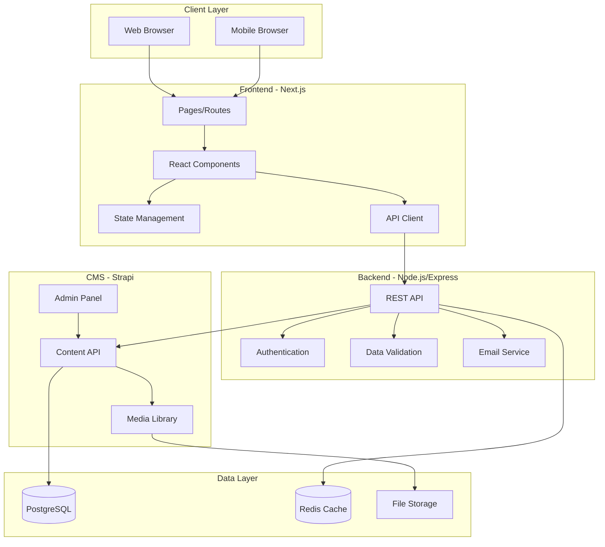
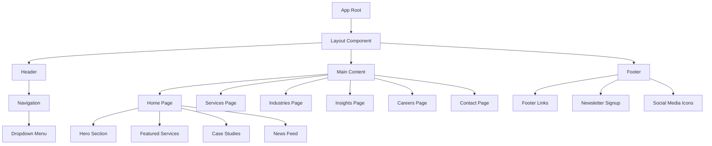

# Design Document

## Overview

The enterprise corporate website is a full-stack web application built with Next.js 14 (React framework) for the front-end, Node.js/Express for the backend API, and a headless CMS (Strapi) for content management. The architecture follows modern web development best practices with server-side rendering (SSR) for SEO, component-based design for reusability, and a clean separation between presentation and business logic.

The design emphasizes performance, accessibility, and maintainability while delivering a professional enterprise aesthetic with a white and red color scheme. The system supports dynamic content delivery, responsive layouts across all devices, and provides administrators with intuitive content management capabilities.

## Architecture

### System Architecture



### Technology Stack

**Frontend:**
- Next.js 14 (App Router) - React framework with SSR/SSG capabilities
- TypeScript - Type safety and improved developer experience
- Tailwind CSS - Utility-first CSS framework for rapid styling
- Framer Motion - Animation library for smooth transitions
- React Hook Form - Form handling with validation
- Axios - HTTP client for API requests

**Backend:**
- Node.js 20 LTS - JavaScript runtime
- Express.js - Web application framework
- Strapi 4 - Headless CMS for content management
- PostgreSQL - Relational database
- Redis - Caching layer for performance
- Nodemailer - Email service for form submissions

**DevOps:**
- Docker - Containerization
- Nginx - Reverse proxy and static file serving
- PM2 - Process manager for Node.js
- GitHub Actions - CI/CD pipeline

## Components and Interfaces

### Frontend Component Hierarchy



### Core Reusable Components

1. **Button Component**
   - Props: variant (primary, secondary, outline), size (sm, md, lg), onClick, disabled, children
   - Variants: Primary (red background), Secondary (white background, red border), Outline (transparent, red border)

2. **Card Component**
   - Props: title, description, image, link, variant (service, case-study, article, job)
   - Features: Hover effects, responsive images, flexible content areas

3. **Form Components**
   - Input: text, email, tel, textarea with validation states
   - Select: dropdown with custom styling
   - FileUpload: drag-and-drop with preview
   - Checkbox/Radio: custom styled form controls

4. **Navigation Component**
   - Props: items (array of menu items with optional children)
   - Features: Responsive mobile menu, dropdown menus, active state indication

5. **Modal Component**
   - Props: isOpen, onClose, title, children
   - Features: Backdrop, close on escape, focus trap, scroll lock

6. **Loading Component**
   - Props: variant (spinner, skeleton, progress)
   - Features: Accessible loading states, smooth transitions

### API Interfaces

**Services API**
```typescript
GET /api/services
Response: {
  data: Array<{
    id: string;
    title: string;
    description: string;
    icon: string;
    detailedDescription: string;
    caseStudies: Array<string>;
  }>;
}

GET /api/services/:id
Response: {
  data: {
    id: string;
    title: string;
    description: string;
    icon: string;
    detailedDescription: string;
    features: Array<string>;
    caseStudies: Array<CaseStudy>;
  };
}
```

**Industries API**
```typescript
GET /api/industries
Response: {
  data: Array<{
    id: string;
    name: string;
    description: string;
    icon: string;
    caseExamples: Array<CaseExample>;
    relatedServices: Array<string>;
  }>;
}
```

**Insights API**
```typescript
GET /api/insights?search=<query>&category=<cat>&page=<num>&limit=<num>
Response: {
  data: Array<{
    id: string;
    title: string;
    excerpt: string;
    content: string;
    featuredImage: string;
    category: string;
    publishedAt: string;
    author: Author;
  }>;
  pagination: {
    page: number;
    limit: number;
    total: number;
    totalPages: number;
  };
}
```

**Careers API**
```typescript
GET /api/careers/jobs
Response: {
  data: Array<{
    id: string;
    title: string;
    department: string;
    location: string;
    type: string;
    description: string;
    requirements: Array<string>;
    responsibilities: Array<string>;
  }>;
}

POST /api/careers/apply
Request: {
  jobId: string;
  firstName: string;
  lastName: string;
  email: string;
  phone: string;
  resume: File;
  coverLetter: string;
}
Response: {
  success: boolean;
  message: string;
  applicationId: string;
}
```

**Contact API**
```typescript
POST /api/contact
Request: {
  name: string;
  email: string;
  phone: string;
  subject: string;
  message: string;
}
Response: {
  success: boolean;
  message: string;
}

GET /api/contact/locations
Response: {
  data: Array<{
    id: string;
    name: string;
    address: string;
    city: string;
    country: string;
    phone: string;
    email: string;
    coordinates: { lat: number; lng: number };
    businessHours: string;
  }>;
}
```

**Newsletter API**
```typescript
POST /api/newsletter/subscribe
Request: {
  email: string;
}
Response: {
  success: boolean;
  message: string;
}
```

## Data Models

### Service Model
```typescript
interface Service {
  id: string;
  title: string;
  slug: string;
  description: string;
  detailedDescription: string;
  icon: string;
  featuredImage: string;
  features: string[];
  benefits: string[];
  caseStudies: CaseStudy[];
  relatedServices: Service[];
  createdAt: Date;
  updatedAt: Date;
  publishedAt: Date;
}
```

### Industry Model
```typescript
interface Industry {
  id: string;
  name: string;
  slug: string;
  description: string;
  icon: string;
  featuredImage: string;
  caseExamples: CaseExample[];
  statistics: Statistic[];
  testimonials: Testimonial[];
  relatedServices: Service[];
  createdAt: Date;
  updatedAt: Date;
}
```

### Article Model
```typescript
interface Article {
  id: string;
  title: string;
  slug: string;
  excerpt: string;
  content: string; // Rich text/Markdown
  featuredImage: string;
  category: Category;
  tags: string[];
  author: Author;
  publishedAt: Date;
  updatedAt: Date;
  seo: SEOMetadata;
}
```

### Job Model
```typescript
interface Job {
  id: string;
  title: string;
  slug: string;
  department: string;
  location: string;
  type: 'Full-time' | 'Part-time' | 'Contract' | 'Internship';
  description: string;
  requirements: string[];
  responsibilities: string[];
  benefits: string[];
  salaryRange?: string;
  postedAt: Date;
  expiresAt?: Date;
  isActive: boolean;
}
```

### Application Model
```typescript
interface Application {
  id: string;
  jobId: string;
  firstName: string;
  lastName: string;
  email: string;
  phone: string;
  resumeUrl: string;
  coverLetter: string;
  status: 'pending' | 'reviewed' | 'interview' | 'rejected' | 'accepted';
  submittedAt: Date;
  updatedAt: Date;
}
```

### Contact Submission Model
```typescript
interface ContactSubmission {
  id: string;
  name: string;
  email: string;
  phone: string;
  subject: string;
  message: string;
  status: 'new' | 'read' | 'responded';
  submittedAt: Date;
  ipAddress: string;
}
```

### Newsletter Subscription Model
```typescript
interface NewsletterSubscription {
  id: string;
  email: string;
  status: 'active' | 'unsubscribed';
  subscribedAt: Date;
  unsubscribedAt?: Date;
  confirmationToken?: string;
  isConfirmed: boolean;
}
```

## Correctness Properties

*A property is a characteristic or behavior that should hold true across all valid executions of a system—essentially, a formal statement about what the system should do. Properties serve as the bridge between human-readable specifications and machine-verifiable correctness guarantees.*


### Property Reflection

After reviewing all testable properties from the prework analysis, several redundancies and consolidation opportunities have been identified:

**Redundancies to Address:**
- Properties 2.1, 2.2, 2.3 (responsive breakpoints) can be consolidated into a single property about responsive behavior across all viewport sizes
- Properties 3.1 and 3.2 (service content requirements) can be combined into one comprehensive property about service data completeness
- Properties 4.1, 4.2, 4.3, 4.4 (industry content requirements) can be consolidated into one property about industry data completeness
- Properties 9.1, 9.2, 9.4, 9.5 (SEO and semantic HTML) can be grouped as they all validate HTML structure and metadata
- Properties 10.1, 10.3 (accessibility for interactive elements and forms) can be combined as they both test proper labeling and keyboard access

**Consolidated Properties:**
The final property set eliminates redundancy while maintaining comprehensive coverage of all testable requirements.

### Correctness Properties

**Property 1: Homepage content completeness**
*For any* homepage render, the page should contain a hero section with headline, subtext, and CTA button, a featured services section where each service has an icon and description, a case studies section where each case study has company name and outcome, and a news feed with the 3 most recent articles containing title, excerpt, and publication date.
**Validates: Requirements 1.1, 1.3, 1.4, 1.5**

**Property 2: Responsive layout behavior**
*For any* viewport width, the website should render without horizontal scrolling, apply appropriate layout styles for the viewport size (desktop ≥1024px, tablet 768-1023px, mobile <768px), and maintain content accessibility.
**Validates: Requirements 2.1, 2.2, 2.3, 2.4**

**Property 3: Service data completeness**
*For any* service in the system, it should have a title, description, detailed description, at least one visual element (icon or image), and at least one related case study or example.
**Validates: Requirements 3.1, 3.2, 3.4**

**Property 4: Industry data completeness**
*For any* industry in the system, it should have a name, description, at least one visual element (icon or image), at least one case example, at least one of (statistics, testimonials, or project highlights), and links to related services.
**Validates: Requirements 4.1, 4.2, 4.3, 4.4, 4.5**

**Property 5: Article rendering completeness**
*For any* article displayed on the Insights page, it should include a title, excerpt, featured image, category, and publication date.
**Validates: Requirements 5.1**

**Property 6: Search and filter functionality**
*For any* search query or filter criteria on the Insights page, the displayed articles should only include items that match the search terms (in title or content) and satisfy all applied filter criteria (category, topic, date range).
**Validates: Requirements 5.2, 5.3, 5.5**

**Property 7: Job listing completeness**
*For any* job listing displayed, it should include title, department, location, brief description, detailed description, requirements, and responsibilities.
**Validates: Requirements 6.1, 6.3**

**Property 8: Form validation and submission**
*For any* form submission (contact, application, newsletter), the system should reject submissions with invalid email formats or missing required fields, accept submissions with valid data, and return appropriate success or error responses.
**Validates: Requirements 6.5, 7.2, 8.3**

**Property 9: Location data completeness**
*For any* office location displayed on the Contact page, it should include address, phone number, email address, business hours, and map coordinates.
**Validates: Requirements 7.3, 7.5**

**Property 10: Social media link behavior**
*For any* social media icon in the footer, clicking it should open the corresponding URL in a new browser tab (target="_blank" with rel="noopener noreferrer").
**Validates: Requirements 8.5**

**Property 11: SEO metadata completeness**
*For any* page in the website, it should include meta tags for title, description, and Open Graph properties (og:title, og:description, og:image), use semantic HTML5 elements (header, nav, main, footer), have all images with alt attributes, and maintain proper heading hierarchy without skipping levels.
**Validates: Requirements 9.1, 9.2, 9.4, 9.5**

**Property 12: Clean URL structure**
*For any* primary content page (services, industries, articles, jobs), the URL should be clean and descriptive using slugs without query parameters (e.g., /services/cloud-computing, /insights/digital-transformation).
**Validates: Requirements 9.3**

**Property 13: Accessibility compliance**
*For any* interactive element (button, link, form control), it should be keyboard accessible with visible focus indicators, have proper labels (label element or aria-label), and meet WCAG 2.1 AA contrast ratios (4.5:1 for normal text, 3:1 for large text).
**Validates: Requirements 10.1, 10.2, 10.3**

**Property 14: ARIA live regions for dynamic content**
*For any* dynamic content update (search results, form submission feedback, loading states), the change should be announced to screen readers using appropriate ARIA live regions (aria-live="polite" or "assertive").
**Validates: Requirements 10.4**

**Property 15: Image optimization**
*For any* image served by the website, it should be in an optimized format (WebP with fallback), have appropriate compression, and include responsive sizing attributes (srcset and sizes).
**Validates: Requirements 11.1**

**Property 16: Code splitting implementation**
*For any* page route, only the necessary JavaScript code for that page should be loaded initially, with shared dependencies in separate chunks.
**Validates: Requirements 11.3**

**Property 17: CSS optimization**
*For any* page load, critical CSS should be inlined in the HTML head, and non-critical stylesheets should be loaded asynchronously.
**Validates: Requirements 11.4**

**Property 18: Cache headers for static assets**
*For any* static asset (images, CSS, JavaScript), the HTTP response should include appropriate cache-control headers (e.g., max-age for immutable assets, no-cache for HTML).
**Validates: Requirements 11.5**

**Property 19: CMS authentication and content updates**
*For any* CMS login attempt, valid credentials should grant access to the admin panel while invalid credentials should be rejected, and any content changes saved by an administrator should be reflected on the live website.
**Validates: Requirements 12.1, 12.3**

**Property 20: Image upload optimization**
*For any* image uploaded through the CMS, the system should automatically optimize it (compress, resize, generate thumbnails) and store it in the media library with accessible URLs.
**Validates: Requirements 12.4**

**Property 21: Component prop flexibility**
*For any* reusable component (Button, Card, Form Input), it should accept props for customization and render correctly with different prop combinations without breaking.
**Validates: Requirements 13.2**

**Property 22: Design system consistency**
*For any* styled element in the application, it should use design tokens (CSS variables) for colors, typography, and spacing rather than hard-coded values.
**Validates: Requirements 13.4**

**Property 23: API response format**
*For any* API request, the response should be valid JSON with appropriate HTTP status codes (200 for success, 400 for validation errors, 401 for authentication errors, 404 for not found, 500 for server errors).
**Validates: Requirements 14.2**

**Property 24: API data validation**
*For any* form submission to an API endpoint, invalid data should be rejected with validation error messages, and valid data should be processed and stored successfully.
**Validates: Requirements 14.3**

**Property 25: Data retrieval correctness**
*For any* content request to the API, the system should retrieve the correct data from the database matching the query parameters (filters, pagination, search terms).
**Validates: Requirements 14.4**

**Property 26: API rate limiting and authentication**
*For any* API endpoint, excessive requests from the same client should be rate-limited (e.g., 100 requests per 15 minutes), and protected endpoints should require valid authentication tokens.
**Validates: Requirements 14.5**

**Property 27: Environment configuration**
*For any* environment-specific setting (API URL, database connection, feature flags), the application should read the value from environment variables rather than hard-coded configuration.
**Validates: Requirements 15.4**

## Error Handling

### Frontend Error Handling

**Network Errors:**
- API request failures should display user-friendly error messages
- Implement retry logic with exponential backoff for transient failures
- Show offline indicators when network connectivity is lost
- Cache critical data for offline viewing when possible

**Form Validation Errors:**
- Display inline validation errors next to form fields
- Highlight invalid fields with red borders and error icons
- Provide clear, actionable error messages (e.g., "Email must be in format: user@example.com")
- Prevent form submission until all validation errors are resolved

**Component Errors:**
- Implement React Error Boundaries to catch component rendering errors
- Display fallback UI when components fail to render
- Log errors to monitoring service (e.g., Sentry) for debugging
- Provide "Retry" or "Go Home" options for users

**Loading States:**
- Show skeleton loaders for content that's being fetched
- Display progress indicators for long-running operations
- Implement timeout handling for requests exceeding 30 seconds
- Provide cancel options for user-initiated operations

### Backend Error Handling

**Validation Errors:**
- Return 400 Bad Request with detailed validation error messages
- Include field-specific errors in response body
- Validate all input data before processing
- Sanitize user input to prevent injection attacks

**Authentication Errors:**
- Return 401 Unauthorized for missing or invalid tokens
- Return 403 Forbidden for insufficient permissions
- Implement token refresh logic for expired tokens
- Log authentication failures for security monitoring

**Database Errors:**
- Catch and log database connection errors
- Implement connection pooling and retry logic
- Return 500 Internal Server Error for database failures
- Use transactions for multi-step operations to ensure data consistency

**Rate Limiting:**
- Return 429 Too Many Requests when rate limits are exceeded
- Include Retry-After header indicating when to retry
- Implement sliding window rate limiting per IP address
- Whitelist internal services from rate limiting

**File Upload Errors:**
- Validate file types and sizes before processing
- Return 413 Payload Too Large for oversized files
- Return 415 Unsupported Media Type for invalid file types
- Clean up temporary files after processing

### Error Logging and Monitoring

**Logging Strategy:**
- Log all errors with timestamps, user context, and stack traces
- Use structured logging (JSON format) for easy parsing
- Implement log levels (ERROR, WARN, INFO, DEBUG)
- Rotate logs daily and retain for 30 days

**Monitoring:**
- Integrate with monitoring service (e.g., Sentry, DataDog)
- Set up alerts for critical errors and high error rates
- Track error trends and patterns over time
- Monitor API response times and error rates

## Testing Strategy

The testing strategy employs a comprehensive approach combining unit tests, property-based tests, integration tests, and end-to-end tests to ensure correctness, reliability, and maintainability.

### Unit Testing

**Framework:** Jest with React Testing Library for frontend, Jest for backend

**Coverage Areas:**
- Individual component rendering and behavior
- Utility functions and helper methods
- API route handlers and middleware
- Data validation functions
- Form submission logic

**Example Unit Tests:**
- Button component renders with correct variant styles
- Form validation correctly identifies invalid email formats
- API endpoint returns 400 for missing required fields
- Image optimization utility generates correct sizes
- URL slug generation creates valid, unique slugs

**Best Practices:**
- Test component behavior, not implementation details
- Mock external dependencies (API calls, database queries)
- Use descriptive test names that explain what is being tested
- Aim for 80%+ code coverage for critical paths
- Keep tests fast (< 5 seconds for entire suite)

### Property-Based Testing

**Framework:** fast-check (JavaScript/TypeScript property-based testing library)

**Configuration:**
- Minimum 100 iterations per property test
- Use seed values for reproducible test runs
- Generate edge cases automatically (empty arrays, null values, boundary conditions)

**Coverage Areas:**
Property-based tests will be written for all 27 correctness properties defined in this document. Each property test will:
- Generate random valid inputs within the domain
- Execute the system behavior
- Assert that the property holds for all generated inputs
- Tag the test with the property number and requirement reference

**Example Property Tests:**
- **Property 8: Form validation** - Generate random form data (valid and invalid), verify that validation correctly accepts/rejects based on rules
- **Property 11: SEO metadata** - Generate random page data, verify all pages have required meta tags and semantic HTML
- **Property 23: API response format** - Generate random API requests, verify all responses are valid JSON with correct status codes

**Test Tagging Format:**
```typescript
// Feature: enterprise-corporate-website, Property 8: Form validation and submission
// Validates: Requirements 6.5, 7.2, 8.3
test('form validation property', () => {
  fc.assert(
    fc.property(formDataArbitrary, (formData) => {
      const result = validateForm(formData);
      // Property assertions
    }),
    { numRuns: 100 }
  );
});
```

### Integration Testing

**Framework:** Jest with Supertest for API testing

**Coverage Areas:**
- API endpoint integration with database
- CMS content updates propagating to frontend
- File upload and storage workflows
- Email sending for form submissions
- Authentication and authorization flows

**Example Integration Tests:**
- POST /api/contact saves submission to database and sends email
- CMS content update triggers cache invalidation
- Image upload creates optimized versions and updates media library
- Newsletter subscription adds email to database and sends confirmation

### End-to-End Testing

**Framework:** Playwright (cross-browser testing)

**Coverage Areas:**
- Critical user journeys (homepage → services → contact)
- Form submissions with validation
- Responsive behavior across devices
- Navigation and routing
- Search and filter functionality

**Example E2E Tests:**
- User can navigate from homepage to services page and submit contact form
- Search on Insights page filters articles correctly
- Mobile menu opens and closes properly
- Job application form validates and submits successfully

### Performance Testing

**Tools:** Lighthouse CI, WebPageTest

**Metrics:**
- First Contentful Paint < 1.5s
- Largest Contentful Paint < 2.5s
- Time to Interactive < 3.5s
- Cumulative Layout Shift < 0.1
- Total Blocking Time < 200ms

**Testing Approach:**
- Run Lighthouse audits in CI pipeline
- Set performance budgets for bundle sizes
- Monitor Core Web Vitals in production
- Test on throttled 3G connections

### Accessibility Testing

**Tools:** axe-core, Pa11y, manual testing with screen readers

**Coverage:**
- Automated accessibility scans on all pages
- Keyboard navigation testing
- Screen reader compatibility (NVDA, JAWS, VoiceOver)
- Color contrast verification
- ARIA attribute validation

### Testing Workflow

1. **Development:** Write unit tests alongside feature implementation
2. **Property Tests:** Implement property-based tests for correctness properties after core logic is complete
3. **Integration:** Write integration tests for API endpoints and workflows
4. **E2E:** Add end-to-end tests for critical user journeys
5. **CI/CD:** Run all tests on every commit, block merges if tests fail
6. **Monitoring:** Track test coverage and flakiness over time

## Design System

### Color Palette

**Primary Colors:**
- Primary Red: `#E31837` (brand primary)
- Dark Red: `#B91429` (hover states, emphasis)
- Light Red: `#FF4D6A` (accents, highlights)

**Neutral Colors:**
- White: `#FFFFFF` (backgrounds, text on dark)
- Light Gray: `#F5F5F5` (section backgrounds)
- Medium Gray: `#E0E0E0` (borders, dividers)
- Dark Gray: `#333333` (body text)
- Black: `#000000` (headings, emphasis)

**Semantic Colors:**
- Success: `#4CAF50`
- Warning: `#FF9800`
- Error: `#F44336`
- Info: `#2196F3`

### Typography

**Font Families:**
- Headings: `'Inter', -apple-system, BlinkMacSystemFont, 'Segoe UI', sans-serif`
- Body: `'Inter', -apple-system, BlinkMacSystemFont, 'Segoe UI', sans-serif`
- Monospace: `'Fira Code', 'Courier New', monospace`

**Type Scale:**
- H1: 48px / 56px line-height (desktop), 36px / 44px (mobile)
- H2: 40px / 48px line-height (desktop), 30px / 38px (mobile)
- H3: 32px / 40px line-height (desktop), 24px / 32px (mobile)
- H4: 24px / 32px line-height
- H5: 20px / 28px line-height
- H6: 18px / 26px line-height
- Body: 16px / 24px line-height
- Small: 14px / 20px line-height
- Caption: 12px / 18px line-height

**Font Weights:**
- Regular: 400
- Medium: 500
- Semibold: 600
- Bold: 700

### Spacing System

**Base Unit:** 4px

**Spacing Scale:**
- xs: 4px
- sm: 8px
- md: 16px
- lg: 24px
- xl: 32px
- 2xl: 48px
- 3xl: 64px
- 4xl: 96px

### Breakpoints

- Mobile: 0-767px
- Tablet: 768-1023px
- Desktop: 1024-1439px
- Large Desktop: 1440px+

### Component Specifications

**Button:**
- Heights: Small (32px), Medium (40px), Large (48px)
- Padding: Small (12px 16px), Medium (16px 24px), Large (20px 32px)
- Border Radius: 4px
- Font Weight: 600
- Transition: all 0.2s ease

**Card:**
- Border Radius: 8px
- Box Shadow: 0 2px 8px rgba(0,0,0,0.1)
- Hover Shadow: 0 4px 16px rgba(0,0,0,0.15)
- Padding: 24px
- Transition: all 0.3s ease

**Input:**
- Height: 40px
- Padding: 12px 16px
- Border: 1px solid #E0E0E0
- Border Radius: 4px
- Focus Border: 2px solid #E31837
- Font Size: 16px

### Animation Guidelines

**Timing Functions:**
- Ease Out: `cubic-bezier(0.0, 0.0, 0.2, 1)` - for entrances
- Ease In: `cubic-bezier(0.4, 0.0, 1, 1)` - for exits
- Ease In Out: `cubic-bezier(0.4, 0.0, 0.2, 1)` - for transitions

**Durations:**
- Fast: 150ms - micro-interactions (hover, focus)
- Medium: 300ms - component transitions (modals, dropdowns)
- Slow: 500ms - page transitions, complex animations

**Principles:**
- Use subtle animations to enhance UX, not distract
- Respect prefers-reduced-motion for accessibility
- Animate transform and opacity for performance
- Avoid animating layout properties (width, height, margin)

## Deployment Architecture

### Infrastructure

**Hosting:**
- Frontend: Vercel or Netlify (Next.js optimized)
- Backend API: AWS EC2 or DigitalOcean Droplet
- CMS: Self-hosted on same server as API or separate instance
- Database: AWS RDS PostgreSQL or managed PostgreSQL service
- Cache: AWS ElastiCache Redis or managed Redis service
- File Storage: AWS S3 or DigitalOcean Spaces

**Domain and DNS:**
- Domain registrar: Namecheap, Google Domains, or AWS Route 53
- DNS: Cloudflare for CDN and DDoS protection
- SSL: Let's Encrypt or Cloudflare SSL

### Containerization

**Docker Setup:**
```yaml
services:
  frontend:
    build: ./frontend
    ports:
      - "3000:3000"
    environment:
      - NEXT_PUBLIC_API_URL=${API_URL}
    depends_on:
      - backend

  backend:
    build: ./backend
    ports:
      - "4000:4000"
    environment:
      - DATABASE_URL=${DATABASE_URL}
      - REDIS_URL=${REDIS_URL}
    depends_on:
      - postgres
      - redis

  cms:
    image: strapi/strapi
    ports:
      - "1337:1337"
    environment:
      - DATABASE_CLIENT=postgres
      - DATABASE_URL=${DATABASE_URL}
    depends_on:
      - postgres

  postgres:
    image: postgres:15
    environment:
      - POSTGRES_DB=corporate_website
      - POSTGRES_USER=${DB_USER}
      - POSTGRES_PASSWORD=${DB_PASSWORD}
    volumes:
      - postgres_data:/var/lib/postgresql/data

  redis:
    image: redis:7-alpine
    volumes:
      - redis_data:/data

volumes:
  postgres_data:
  redis_data:
```

### CI/CD Pipeline

**GitHub Actions Workflow:**
1. **Lint and Type Check:** Run ESLint and TypeScript compiler
2. **Unit Tests:** Run Jest tests with coverage reporting
3. **Property Tests:** Run fast-check property-based tests
4. **Integration Tests:** Run API integration tests
5. **Build:** Build frontend and backend for production
6. **E2E Tests:** Run Playwright tests against staging environment
7. **Deploy:** Deploy to staging, run smoke tests, deploy to production

**Deployment Strategy:**
- Blue-green deployment for zero-downtime updates
- Automatic rollback on failed health checks
- Database migrations run before deployment
- Cache invalidation after successful deployment

### Monitoring and Logging

**Application Monitoring:**
- Error tracking: Sentry
- Performance monitoring: New Relic or DataDog
- Uptime monitoring: Pingdom or UptimeRobot
- Log aggregation: ELK Stack or CloudWatch Logs

**Metrics to Track:**
- API response times and error rates
- Database query performance
- Cache hit rates
- User session duration and bounce rates
- Core Web Vitals (LCP, FID, CLS)

### Security Considerations

**Frontend Security:**
- Content Security Policy (CSP) headers
- XSS protection with React's built-in escaping
- HTTPS only with HSTS headers
- Secure cookie flags (HttpOnly, Secure, SameSite)

**Backend Security:**
- Input validation and sanitization
- SQL injection prevention with parameterized queries
- Rate limiting to prevent abuse
- CORS configuration for allowed origins
- JWT authentication with short expiration times
- Password hashing with bcrypt (cost factor 12)

**Infrastructure Security:**
- Firewall rules limiting access to necessary ports
- Regular security updates and patches
- Database backups (daily full, hourly incremental)
- Secrets management with environment variables or AWS Secrets Manager
- DDoS protection with Cloudflare

## Documentation Requirements

### Setup Documentation

**README.md:**
- Project overview and features
- Technology stack
- Prerequisites (Node.js version, database, etc.)
- Installation instructions
- Environment variable configuration
- Running in development mode
- Building for production
- Running tests

**DEPLOYMENT.md:**
- Server requirements
- Docker deployment instructions
- Environment configuration
- Database setup and migrations
- SSL certificate setup
- Domain configuration
- Monitoring setup

### Developer Documentation

**CONTRIBUTING.md:**
- Code style guidelines
- Git workflow (branching strategy, commit messages)
- Pull request process
- Testing requirements
- Code review checklist

**ARCHITECTURE.md:**
- System architecture overview
- Component structure
- Data flow diagrams
- API documentation
- Database schema
- Design patterns used

### User Documentation

**CMS_GUIDE.md:**
- Logging into the CMS
- Creating and editing pages
- Managing services and industries
- Publishing articles
- Uploading and managing media
- Managing job listings
- Viewing form submissions

**CUSTOMIZATION.md:**
- Updating colors and branding
- Modifying typography
- Adding new pages
- Customizing components
- Updating content
- Managing navigation menus

### API Documentation

**API.md:**
- Authentication
- Endpoint reference with request/response examples
- Error codes and messages
- Rate limiting details
- Pagination format
- Filtering and search syntax

## Maintenance and Scalability

### Performance Optimization

**Frontend:**
- Implement route-based code splitting
- Use dynamic imports for heavy components
- Optimize images with next/image
- Implement virtual scrolling for long lists
- Use React.memo for expensive components
- Implement service worker for offline support

**Backend:**
- Database query optimization with indexes
- Implement Redis caching for frequently accessed data
- Use connection pooling for database connections
- Implement pagination for large datasets
- Compress API responses with gzip
- Use CDN for static assets

### Scalability Considerations

**Horizontal Scaling:**
- Stateless API design for easy horizontal scaling
- Load balancer (Nginx or AWS ALB) for distributing traffic
- Session storage in Redis for multi-instance support
- Database read replicas for read-heavy workloads

**Vertical Scaling:**
- Monitor resource usage and scale instance sizes as needed
- Optimize database queries to reduce CPU usage
- Implement caching to reduce database load

### Backup and Recovery

**Backup Strategy:**
- Daily full database backups
- Hourly incremental backups
- Media file backups to separate storage
- Backup retention: 30 days
- Test restore procedures monthly

**Disaster Recovery:**
- Document recovery procedures
- Maintain staging environment for testing
- Keep infrastructure as code (Terraform or CloudFormation)
- Regular disaster recovery drills

### Update and Maintenance Schedule

**Regular Updates:**
- Security patches: As soon as available
- Dependency updates: Monthly
- Framework updates: Quarterly
- Content updates: As needed via CMS

**Monitoring and Alerts:**
- Set up alerts for high error rates
- Monitor disk space and database size
- Track API response times
- Monitor SSL certificate expiration
